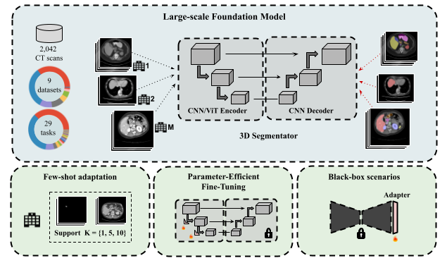

# Few-Shot Efficient Fine-Tuning

The recent popularity of foundation models and the pre-train-and-adapt paradigm, where a large-scale model is transferred to downstream tasks,
is gaining attention for volumetric medical image segmentation. However, current transfer learning strategies devoted to full fine-tuning for
transfer learning may require significant resources and yield sub-optimal results when the labeled data of the target task is scarce. This makes
its applicability in real clinical settings challenging since these institutions are usually constrained on data and computational resources to
develop proprietary solutions. To address this challenge, **we formalize Few-Shot Efficient Fine-Tuning (FSEFT), a novel and realistic scenario for
adapting medical image segmentation foundation models. This setting considers the key role of both data- and parameter- efficiency during adaptation**.

 <br/>

<b>Towards Foundation Models and Few-Shot Parameter-Efficient Fine-Tuning for Volumetric Organ Segmentation</b> <br/>
[Julio Silva-Rodríguez](https://scholar.google.es/citations?user=1UMYgHMAAAAJ&hl), [Jose Dolz](https://scholar.google.es/citations?user=yHQIFFMAAAAJ&hl),
[Ismail Ben Ayed](https://scholar.google.es/citations?user=29vyUccAAAAJ&hl) - ÉTS Montréal <br/>
📜 Medical Image Analysis, 2025\
🏅 <span style="color:red">*Best Paper Award at 1st MICCAI Workshop on Foundation Models (MedAGI'23)*</span> \
| [Project](https://jusiro.github.io/projects/fseft.html) | [Journal](https://arxiv.org/abs/2303.17051) | [ArXiv](https://arxiv.org/abs/2303.17051) |

This repository contains a framework for adapting foundation models for volumetric (CT) medical image segmentation: 

- [x] **Supervised pre-training** of large-scale foundation models using partial labeled datasets.
- [x] **Few-shot adaptation**: only requires few-labeled volumes for an enhanced performance.
- [x] **Black-box adaptation** on datasets with domain drifts, but known organs.
- [x] Parameter-Efficient Fine-Tuning (**PEFT**) of such models to novel tasks: LoRA, Adaptformer, and others.
- [x] Directly **operates over other pre-trained models**: [CLIP-Driven](https://github.com/ljwztc/CLIP-Driven-Universal-Model), [SuPreM](https://github.com/MrGiovanni/SuPreM), and more to come!

## 0. Installation
Create environment, clone repository and install required packages (check compatibility with your cuda version).

```
conda create -n fseft python=3.9 -y
conda activate fseft
conda install pytorch==2.0.1 torchvision==0.15.2 torchaudio==2.0.2 pytorch-cuda=11.7 -c pytorch -c nvidia
pip install 'monai[all]'
pip install -r requirements.txt
```

## 1. Foundation model pre-training (*Optional*)

The foundation model is trained on CT scans, using 29 different anatomical structures (see `pretrain/datasets/utils.py` for details), and 9 different datasets:
[BTCV](https://www.synapse.org/#!Synapse:syn3193805/wiki/217789),
[CHAOS](https://chaos.grand-challenge.org/Combined_Healthy_Abdominal_Organ_Segmentation/),
[LiTS](https://competitions.codalab.org/competitions/17094#learn_the_details),
[KiTS](https://kits21.kits-challenge.org/participate#download-block),
[AbdomenCT-1K](https://github.com/JunMa11/AbdomenCT-1K),
[AMOS](https://amos22.grand-challenge.org),
[MSD](https://drive.google.com/drive/folders/1HqEgzS8BV2c7xYNrZdEAnrHk7osJJ--2),
[AcdomenCT-12organ](https://github.com/JunMa11/AbdomenCT-1K) 
and [CT-org](https://wiki.cancerimagingarchive.net/pages/viewpage.action?pageId=61080890).
The total 2,022 CT scans used for training are indicated in `pretrain/datasets/train.txt`. Foundation model is trained using 4 NVIDIA RTX A600 GPUs, using distributed learning as follows:

If training from scratch, you will also need the self-supervised pre-trained weights from [Tang et al. (2022)](https://arxiv.org/abs/2111.14791) for the Swin-UNETR encoder.

```
conda install -c menpo wget
cd ./pretrain/pretrained_weights/
wget https://github.com/Project-MONAI/MONAI-extra-test-data/releases/download/0.8.1/swin_unetr.base_5000ep_f48_lr2e-4_pretrained.pt
cd ../
```

Then, you can do your own training. 

```
CUDA_DEVICE_ORDER="PCI_BUS_ID" CUDA_VISIBLE_DEVICES=0,1,2,3 python -W ignore -m torch.distributed.launch --nproc_per_node=4 --master_port=1234 main_pretrain.py --dist True --num_workers 6 --batch_size 2 --num_samples 3 --max_epoch 1000 --lr 1e-4 --balanced True
```

## 2. Few-shot Efficient Fine-tuning (FSEFT)

## 2.1. Datasets

We have prepared the adaptation experiments to be performed on datasets with severe domain drifts with respect to pre-training.

| Dataset                                                            | Selected Tasks                                             |
|:-------------------------------------------------------------------|:-----------------------------------------------------------|
| [TotalSegmentator](https://zenodo.org/record/6802614#.ZBDA3dLMKV4) | Binary segmentation on 9 base organs                       |
|                                                                    | Parcellation of novel structures: heart, lung, and gluteus |
| [FLARE22](https://flare22.grand-challenge.org/)                    | Multi-class segmetation of 9 base organs                   |

* The employed train/test splits are located at  `local_data/partitions/transferability.txt`.
* Check `local_data/datasets/README.md` for an overview on how to organize these datasets.

## 2.2. Pre-trained models

The FSEFT can be carried out with several recent released pre-trained foundation models. Please, download the dataset from
the weights link provided, and store it at `models/pretrained_weights/[ID].pth` for its use. 

| Model Name                                                                                                                                                                                 |       | Architecture | Model [ID]       | Repository                                                                                    | Weights                                                                                                                                       |
|:-------------------------------------------------------------------------------------------------------------------------------------------------------------------------------------------|:-----:|:-------------|:-----------------|:----------------------------------------------------------------------------------------------|:----------------------------------------------------------------------------------------------------------------------------------------------|
| [Self-Supervised](https://openaccess.thecvf.com/content/CVPR2022/papers/Tang_Self-Supervised_Pre-Training_of_Swin_Transformers_for_3D_Medical_Image_Analysis_CVPR_2022_paper.pdf)          | 2022  | Swin-UNETR   | selfsup          | [LINK](https://github.com/Project-MONAI/)                                                     | [LINK](https://github.com/Project-MONAI/MONAI-extra-test-data/releases/download/0.8.1/swin_unetr.base_5000ep_f48_lr2e-4_pretrained.pt)        |
| [Dataset-specific (BTCV)](https://openaccess.thecvf.com/content/CVPR2022/papers/Tang_Self-Supervised_Pre-Training_of_Swin_Transformers_for_3D_Medical_Image_Analysis_CVPR_2022_paper.pdf ) | 2022  | Swin-UNETR   | btcv             | [SwinUNETR](https://github.com/Project-MONAI/research-contributions/tree/main/SwinUNETR/BTCV) | [LINK](https://github.com/Project-MONAI/MONAI-extra-test-data/releases/download/0.8.1/swin_unetr.base_5000ep_f48_lr2e-4_pretrained.pt)        |
| [CLIP-Driven](https://openaccess.thecvf.com/content/ICCV2023/papers/Liu_CLIP-Driven_Universal_Model_for_Organ_Segmentation_and_Tumor_Detection_ICCV_2023_paper.pdf)                        | 2023  | Swin-UNETR   | clipdriven       | [CLIP-Driven](https://github.com/ljwztc/CLIP-Driven-Universal-Model)                          | [LINK](https://huggingface.co/MrGiovanni/SuPreM/resolve/main/supervised_clip_driven_universal_swin_unetr_2100.pth?download=true)              |
| **FSEFT**                                                                                                                                                                                  | 2023  | Swin-UNETR   | fseft            | *Ours* ⭐                                                                                      | [LINK](https://drive.google.com/file/d/18yLNxmWGnVifQNeYYwyyu56Cg4tWV9aW/view?usp=sharing)                                                    |
 | [SuPreM](https://openreview.net/pdf?id=AhizIPytk4)                                                                                                                                         | 2024  | Swin-UNETR   | suprem_swinunetr | [SuPreM](https://github.com/MrGiovanni/SuPreM)                                                | [LINK](https://huggingface.co/MrGiovanni/SuPreM/resolve/main/supervised_suprem_swinunetr_2100.pth?download=true)                              |
| [SuPreM](https://openreview.net/pdf?id=AhizIPytk4)                                                                                                                                         | 2024  | U-Net        | suprem_unet      | [SuPreM](https://github.com/MrGiovanni/SuPreM)                                                | [LINK](https://huggingface.co/MrGiovanni/SuPreM/resolve/main/supervised_suprem_unet_2100.pth?download=true)                                   |

The configuration of each model is located at `models/configs.py`.

**Note**: Please, check other authors' repositories for an updated link to the weights.

## 2.3. Black-box Adapters

When using supervised pre-trained models, these can be adapters efficiently, in a black-box manner. This is, using only the
pre-trained output representation with the frozen model. These experiments provide robust few-shot adaptation performance, by
training a lightweight logisitic regression classifier (LP), or a spatial Adapter.

```
python main_fseft.py --model_id fseft --dataset flare --organ selected --k 1 --method LP seeds 3
python main_fseft.py --model_id fseft --dataset flare --organ selected --k 1 --method bb3DAdapter seeds 3
```

## 2.4. Parameter-Efficient Fine-tuning

Finally, if you want to transfer the pre-trained model to new tasks, we recommend using Parameter-Efficient Fine-Tuning on the model encoder,
and specializing the decoder for the new tasks. You have several implemented solutions: Affine-LN or Bias selective tuning, or LoRA/Adaptformer methods.
Take a look to `main_fseft.py` for more options!

```
python main_fseft.py --model_id fseft --dataset totalseg --organ heart_atrium_left --k 10 --method LoRA --decoder fine-tuned seeds 3
```

**<u>Note 1</u>**: for PEFT, you may need larger resources than in black-box adaptation. Our black-box experiments are carried out using a single GPU GeForce RTX 3060
with 12 Gb of RAM Memory. \
**<u>Note 2</u>**: training configs are specified at `./fseft/modeling/configs.py`. Please, modify the codebase accordingly if you want to include new methods.

## Acknowledgement

* The framework is build upon the [MONAI](https://github.com/Project-MONAI/MONAI) library for medical image segmentation.
* The implementation and pre-training of the foundational model is largely based on the [CLIP-Driven](https://github.com/ljwztc/CLIP-Driven-Universal-Model) implementation.
* We thank the authors from [CLIP-Driven](https://github.com/ljwztc/CLIP-Driven-Universal-Model) and [SuPreM](https://github.com/MrGiovanni/SuPreM) for making their pre-trained models
publicly available for research purposes.

## Citation

If you find this repository useful, please consider citing this paper:
```
@article{FSEFT,
  title={Towards Foundation Models and Few-Shot Parameter-Efficient Fine-Tuning for Volumetric Organ Segmentation},
  author={Julio Silva-Rodríguez and Jose Dolz and Ismail Ben Ayed},
  journal={Medical Image Analysis},
  year={2025}
}
```


